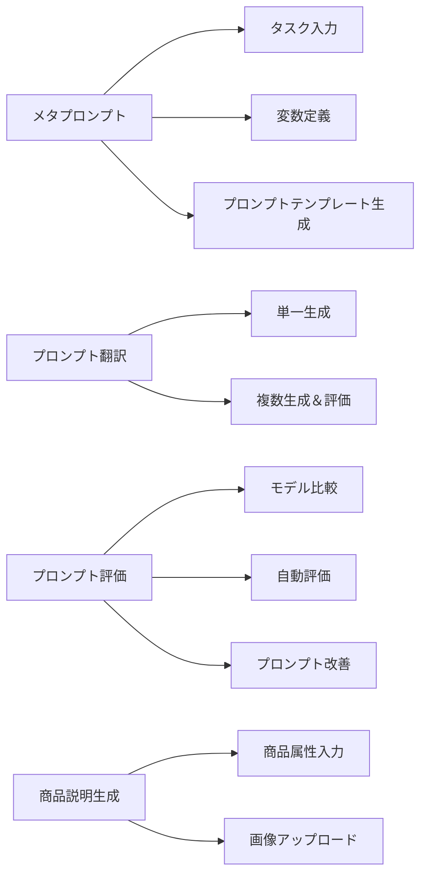

# Llama プロンプトジェネレーター

プロンプトの自動生成・最適化を行うAIアプリケーション。GradioベースのUIで以下の機能を提供：

- メタプロンプト生成
- プロンプト翻訳・最適化
- プロンプト評価と比較
- SOE最適化商品説明生成
- プロンプトキャリブレーション

## セットアップ

- 環境変数の設定 (.envファイルを作成):

```ini
GROQ_API_KEY=your_groq_api_key
OPENROUTER_API_KEY=your_openrouter_api_key
LANGUAGE=ja  # or en
```

- 依存パッケージのインストール:

```bash
cd src
pip install -r requirements.txt
```

- アプリケーション起動:

```bash
python app.py
```

→ ローカルサーバーが起動 (通常 <http://localhost:7860>)

## プロジェクト構成

- `src/`: メインソースコード
  - `app.py`: Gradioメインアプリ
  - `ape.py`: 自動プロンプトエンジニアリング(APE)実装
  - `metaprompt.py`: メタプロンプト生成
  - `optimize.py`: プロンプト最適化＆評価
  - `translate.py`: プロンプト翻訳
  - `calibration.py`: プロンプトキャリブレーション
  - `application/soe_prompt.py`: 商品説明生成
  - `prompt/`: プロンプトテンプレートディレクトリ
  - `translations.json`: 多言語対応辞書

## 機能説明



## ライセンス

MIT License

## 連絡先

問題報告: GitHub Issues まで
